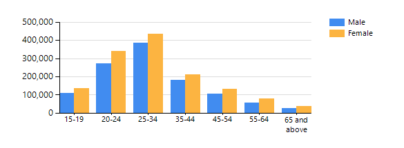

# 2024-Employment-rate-in-National-Capital-Region

The Philippines' economy is heavily service-centered due to the significant contribution of the service sector to its GDP and employment. This dominance is largely driven by the growth of the IT-BPM (Business Process Outsourcing) industry and the tourism sector. Factors like a skilled workforce with strong English proficiency, relatively affordable labor costs, and government support for outsourcing have fueled this trend.

Lets take a look on the employment in the National Capital Region composed of

 
